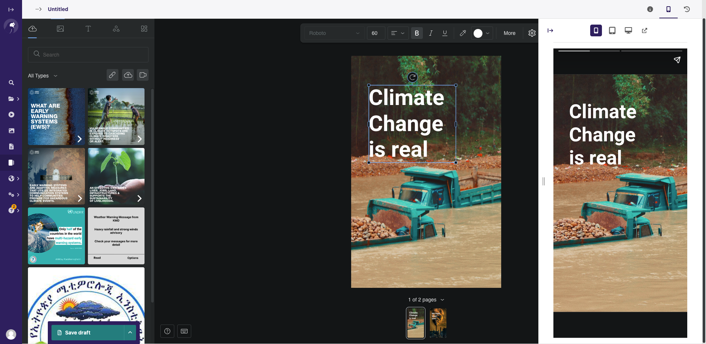
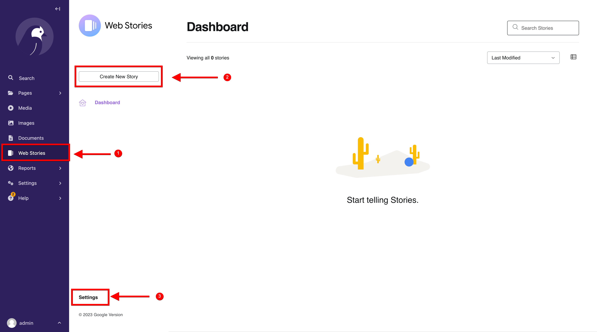

# wagtail-webstories-editor

Integrate Google Web Stories Editor in Wagtail Projects.

This is an effort to integrate the standalone version
of [Web Stories for WordPress plugin](https://github.com/GoogleForCreators/web-stories-wp) into wagtail.

# Table of Contents

- Overview
    - Features
- Installation
- Usage
- Example App

# Overview

This package brings [Web Stories for WordPress plugin](https://github.com/GoogleForCreators/web-stories-wp) to Wagtail
by providing integrations with the Wagtail Admin, mainly by use of custom snippet viewsets



## Features

- Editor for creating webstories. The editor brings most features provided by
  the [Web Stories for WordPress](https://github.com/GoogleForCreators/web-stories-wp)
- Dashboard for listing and managing stories
- Settings interface for configuring web stories settings including:
    - Google Analytics Integration
    - Setting publisher logos
    - Opt-in to use Google Cache for videos
- Integration with `Wagtail Images` to use the Wagtail image chooser
  and [Wagtail Media](https://github.com/torchbox/wagtailmedia) to use it's `Media Choosers` for `Audio` and `Video`
- On top of the features provided by the Editor and Dashboard, the package uses most of
  the  [Snippets Optional Features](https://docs.wagtail.org/en/v5.1.3/topics/snippets/features.html) to bring enable
  the following features:
    - Making WebStories previewable using the wagtail `PreviewableMixin`
    - Saving revisions for WeStories using `RevisionMixin`
    - Saving draft changes for WebStories using `DraftStateMixin`
    - Locking WebStories using `LockableMixin`
    - Enabling workflows for WebStories using `WorkflowMixin`

# Installation

```shell
pip install wagtail-webstories-editor
```

The following dependencies will be installed as well if not yet installed:

- django-filter
- wagtailmedia

# Usage

Add the following to your `INSTALLED_APPS` if not yet added:

```python

INSTALLED_APPS = [
    ...
    "wagtail_webstories_editor",
    "wagtail.api.v2",
    "wagtailmedia",
    "django_filters",
    "wagtail.contrib.settings",
    "django.contrib.sitemaps",

    ...
]
```

Run migrations

```shell
python manage.py migrate wagtail_webstories_editor
```

You also need to enable [Wagtail's API](https://docs.wagtail.org/en/stable/advanced_topics/api/v2/configuration.html)
for images, documents, and media. To do, you can follow the steps below:

- Make sure `wagtail.api.v2` is added to your installed apps
- Create an `api.py` where you will configure your endpoints to expose .The package adds a few custom functions to the
  default provided Images, Documents, and Media ViewSet classes to build compatibility with WebStories `apiCallbacks`.
  You can import them and use them as below:

```python
# api.py
from wagtail.api.v2.router import WagtailAPIRouter

from wagtail_webstories_editor.api_viewsets import (CustomImagesAPIViewSet,
                                                    CustomMediaAPIViewSet,
                                                    CustomDocumentAPIViewSet)

api_router = WagtailAPIRouter('wagtailapi')

api_router.register_endpoint('images', CustomImagesAPIViewSet)
api_router.register_endpoint("media", CustomMediaAPIViewSet)
api_router.register_endpoint('documents', CustomDocumentAPIViewSet)

```

Next, register the URLs so Django can route requests into the API:

```python

# urls.py

from .api import api_router

urlpatterns = [
    ...

    path('api/v2/', api_router.urls),

    ...

    # Ensure that the api_router line appears above the default Wagtail page serving route
    re_path(r'^', include(wagtail_urls)),
]
```

If everything went ok, a new `Web Stories` menu item will be to your Wagtail Admin Menu



1. Click to show the WebStories dashboard
2. Create a new WebStory
3. Access WebStories Settings

# Settings

- `WAGTAIL_WEBSTORIES_EDITOR_LISTING_PAGE_MODEL` : Model for your WebStories listing Page. This will be used to generate
  urls for individual stories, since stories are saved as snippets and not Wagtail Pages. See below for details

## Integrating with Wagtail pages for story links and SEO

WebStories uses Wagtail Snippets to integrate the Editor and Dashboard. The settings component uses Wagtail Site
Settings.

To get links for individual WebStories on publishing, you create a listing page and tell the WebStories package about
it. The package provides an abstract page that you could inherit from:

```python
# app/models.py
from wagtail_webstories_editor.models import AbstractWebStoryListPage


class WebStoryListPage(AbstractWebStoryListPage):
    pass

```

and then in your `settings.py`, tell webstories of the page using the setting defined above:

````python
# settings.py

WAGTAIL_WEBSTORIES_EDITOR_LISTING_PAGE_MODEL = "app.WebStoryListPage"

````

Ideally you should create `only one` instance of this WebStoryListPage in your Wagtail Project. If you create multiple,
the first one to be queried will be used

The `AbstractWebStoryListPage` adds a few functionalities to help working with WebStories:

- By using
  Wagtail's [RoutablePageMixin](https://docs.wagtail.org/en/stable/reference/contrib/routablepage.html),WebStories will
  be served to users using sub-urls from the listing page
- By extending `get_sitemap_urls` method of the Wagtail's Page model, we are able to add all the urls of `live`
  WebStories to Wagtail's autogenerated sitemap, and thus making sure your WebStories are well indexed for SEO


